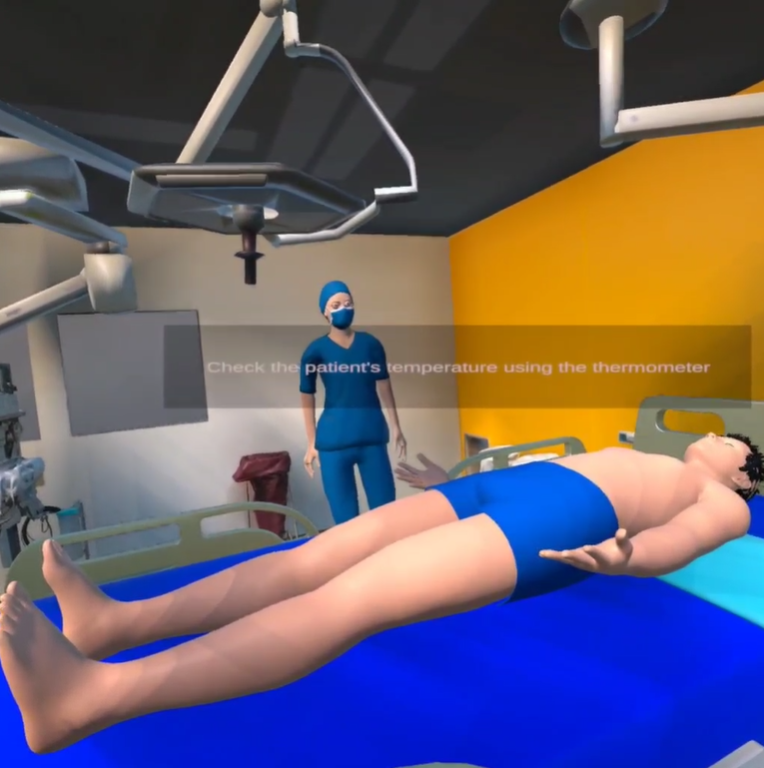
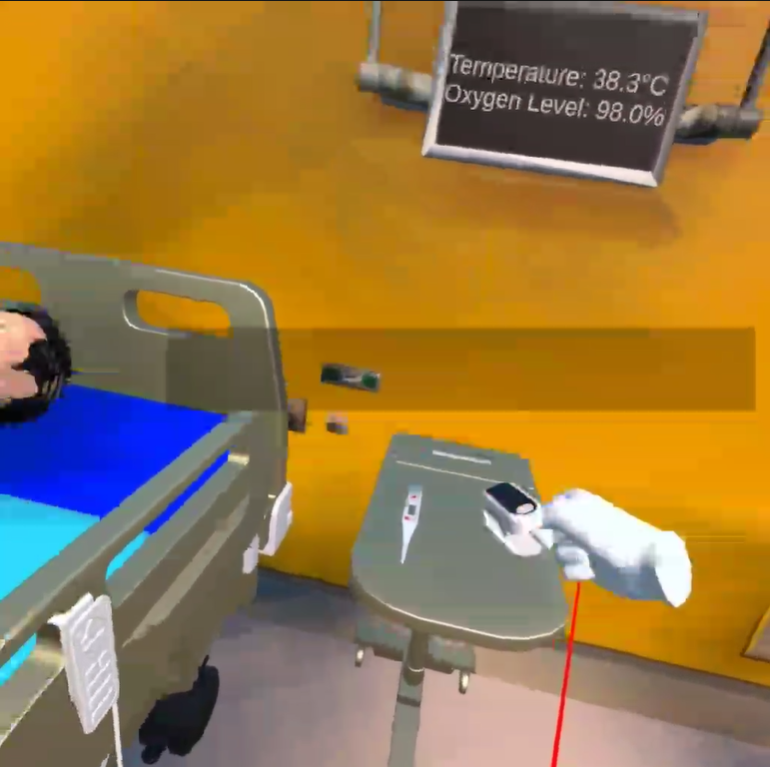
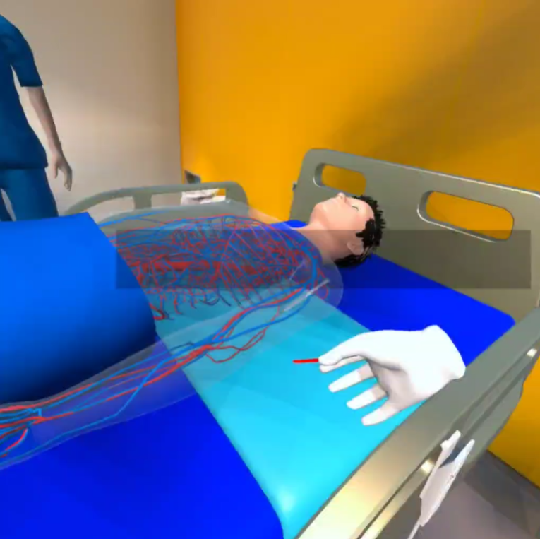

# Note
**April 2023**

This project was built in 36 hours during my second-year at a National Level Hackathon - HackFest24 @ NMAMIT, Karkala

**Asset of the Human model is not included**

# Nurse Training Simulation

A comprehensive hands-on VR simulation developed in Unity for nursing education and training on Meta Quest 2. This immersive application provides realistic medical procedure training with interactive tools and guided learning experiences.

## Overview

VisionPros VR is designed to virtualize nurse training by providing safe, repeatable, and immersive medical procedure simulations. The application features real-world medical scenarios, interactive medical tools, and an intelligent NPC assistant that guides users through training sessions and conducts assessments.






## Features

- **Immersive VR Training**: Full VR experience optimized for Meta Quest 2
- **Real-World Medical Scenarios**: Authentic medical procedure simulations and decision-making scenarios
- **Interactive Medical Tools**: Hands-on interaction with virtual medical equipment
- **NPC Assistant**: AI-guided training companion that provides instruction and conducts viva assessments
- **Comprehensive Training Modules**: Multiple medical procedures and scenarios
- **Progress Tracking**: Assessment and feedback system for learning outcomes

## Tech Stack

- **Unity** - Game engine and development platform
- **C#** - Primary programming language
- **Oculus SDK** - VR integration and Meta Quest 2 support
- **Universal Render Pipeline (URP)** - Enhanced graphics rendering

## System Requirements

### Development Environment
- Unity 2022.3.21f1 LTS or later
- Visual Studio or Visual Studio Code
- Oculus Integration SDK
- Meta Quest Developer Hub

### Target Platform
- Meta Quest 2
- Minimum storage: 3GB available space

## Getting Started

### Prerequisites
1. Install Unity Hub and Unity 2022.3 LTS
2. Install Oculus Integration from Unity Asset Store
3. Enable Developer Mode on your Meta Quest 2
4. Install Meta Quest Developer Hub

### Setup
1. Clone this repository
2. Open the project in Unity
3. Import Oculus Integration package if not already included
4. Configure build settings for Android platform
5. Connect your Meta Quest 2 device
6. Build and deploy to device

### Building the Project
```bash
# In Unity Editor
File → Build Settings → Android → Build and Run
```

## Project Structure

```
Assets/
├── TutorialInfo/           # Project documentation and tutorial assets
│   ├── Scripts/Editor/     # Editor scripts for project setup
│   └── Layout.wlt          # Custom Unity layout
├── Medical Scenarios/      # Training scenario assets
├── Interactive Tools/      # Medical tool prefabs and scripts
├── NPC Assistant/          # AI assistant system
└── VR Integration/         # Oculus SDK integration scripts
```

## Core Components

### ReadmeEditor
The [`ReadmeEditor`](Assets/TutorialInfo/Scripts/Editor/ReadmeEditor.cs) class provides project documentation and setup utilities within the Unity Editor.

### Medical Procedure Simulation
- Interactive medical equipment (Injection, Oxymeter, Thermometer)
- Realistic procedure workflows
- Performance assessment metrics

### NPC Assistant System
- Contextual guidance and instruction
- Real-time feedback during procedures
- Viva examination capabilities

## Training Modules

- Basic Patient Care Procedures
- Emergency Response Scenarios
- Medical Equipment Operation
- Clinical Decision Making
- Patient Communication Skills

## Development Notes

This project uses Unity's Universal Render Pipeline for optimized VR performance and includes custom editor tools for streamlined development workflow.


---

**Note**: This VR application is designed for educational purposes.
